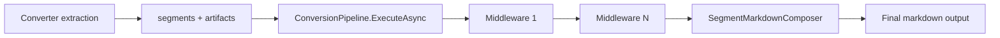

# ADR-0002: Middleware-First Enrichment Orchestration

Status: Implemented  
Date: 2026-02-19  
Related Features: `docs/Features/disk-first-conversion-pipeline.md`, `docs/Features/media-and-image-intelligence-enrichment.md`  
Supersedes: none  
Superseded by: none

---

## Implementation plan (step-by-step)

- [x] Inspect current conversion middleware pipeline and ordering
- [x] Capture contract and rationale for post-extraction middleware
- [x] Document verification and regression expectations
- [x] Link architecture and feature docs

---

## Context

- The project requires cross-cutting enrichment (AI image chat, metadata policies, telemetry) without coupling that logic to every converter.
- Converters must focus on extraction, while enrichment remains composable and reusable.
- Goal: centralize cross-cutting enrichment in an ordered middleware chain.
- Non-goal: replace converter-specific extraction with middleware.

---

## Stakeholders (who needs this to be clear)

| Role | What they need to know | Questions this ADR must answer |
| --- | --- | --- |
| Product / Owner | Consistent enrichment behavior across formats | Is enrichment applied uniformly? |
| Engineering | Extension pattern for cross-cutting behavior | Where should enrichment logic live? |
| DevOps / SRE | Predictable error boundaries | How do middleware failures affect conversion? |
| QA | Testability of enrichment flow | Which tests prove middleware order and effects? |

---

## Decision

Conversion uses an ordered middleware pipeline (`IConversionPipeline` + `IConversionMiddleware`) that runs after converter extraction and before markdown composition.

Key points:

- Converters emit segments/artifacts first.
- Middleware enriches/mutates artifacts in deterministic order.
- Final markdown is composed from post-middleware state.

---

## Diagram

---

## Alternatives considered

### Option A: Embed enrichment inside each converter

- Pros: direct local control in converter implementation
- Cons: duplicated logic, inconsistent behavior, harder maintenance
- Rejected because: violates separation of concerns.

### Option B: Pre-extraction middleware only

- Pros: could filter/route early
- Cons: lacks extracted artifacts/segments context required for enrichment
- Rejected because: enrichment needs converter-produced structures.

---

## Consequences

### Positive

- Reusable cross-cutting enrichment logic.
- Clear ordering and centralized execution point.
- Lower coupling between converters and enrichment providers.

### Negative / risks

- Middleware ordering becomes a behavior dependency.
- Misconfigured middleware can impact all converter outputs.
- Mitigation: keep middleware list explicit and test integration paths.

---

## Impact

### Code

- Affected modules / services: `ConversionPipeline`, middleware implementations, `MarkItDownClient` orchestration.
- New boundaries / responsibilities: converter extraction vs middleware enrichment split.
- Feature flags / toggles: middleware registration through DI/builder and options.

### Data / configuration

- Data model / schema changes: none.
- Config changes: middleware list and provider settings influence enrichment behavior.
- Backwards compatibility strategy: preserve existing converter result contracts.

### Documentation

- Feature docs to update: disk-first and media/image enrichment docs.
- Testing docs to update: middleware test scenarios.
- Architecture docs to update: interfaces/contracts map.
- `docs/Architecture/Overview.md` updates: include pipeline contract in navigation index.
- Notes for `AGENTS.md`: keep middleware execution and diagnostic requirements explicit.

---

## Verification

### Objectives

- Prove middleware executes in expected phase/order.
- Prove enrichment results affect final markdown/artifacts.
- Prove failures surface diagnostics without hiding converter context.

### Test environment

- Environment: local .NET SDK and fixture tests.
- Data/reset strategy: deterministic fixture documents and stub providers.
- External dependencies: optional for live suites only.

### Test commands

- build: `dotnet build MarkItDown.slnx`
- test: `dotnet test MarkItDown.slnx`
- format: `dotnet format MarkItDown.slnx`
- coverage: `dotnet test MarkItDown.slnx --collect:"XPlat Code Coverage"`

### New or changed tests

| ID | Scenario | Level (Unit / Int / API / UI) | Expected result | Notes / Data |
| --- | --- | --- | --- | --- |
| TST-001 | Middleware receives extracted image artifacts and adds enrichment content | Integration | Artifacts/segments include enrichment output | `tests/MarkItDown.Tests/Intelligence/ImageChatEnricherTests.cs` |
| TST-002 | Conversion continues/fails according to middleware and converter policies | Integration | Expected failure semantics preserved | `tests/MarkItDown.Tests/MarkItDownTests.cs` |

### Regression and analysis

- Regression suites: converter + intelligence suites in `tests/MarkItDown.Tests`.
- Static analysis: analyzer enforcement in build.
- Monitoring during rollout: conversion duration and failure counters.

---

## Rollout and migration

- Migration steps: route new cross-cutting logic through middleware, not ad hoc converter code.
- Backwards compatibility: preserve result structure and metadata keys.
- Rollback: remove/reorder middleware registrations causing regression.

---

## References

- `src/MarkItDown/Conversion/ConversionPipeline.cs`
- `src/MarkItDown/Conversion/IConversionMiddleware.cs`
- `src/MarkItDown/Core/MarkItDownClient.cs`
- `src/MarkItDown/Conversion/Middleware/AiImageEnrichmentMiddleware.cs`
