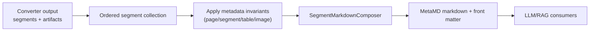

# ADR-0003: Segment Metadata Contract for Markdown Composition

Status: Implemented  
Date: 2026-02-19  
Related Features: `docs/Features/structured-docx-pdf-conversion.md`, `docs/Features/media-and-image-intelligence-enrichment.md`  
Supersedes: none  
Superseded by: none

---

## Implementation plan (step-by-step)

- [x] Review segment and markdown composition contracts
- [x] Document ordering/metadata invariants
- [x] Map invariants to existing tests and docs
- [x] Link architecture and feature specs

---

## Context

- The project outputs Markdown for LLM/RAG workflows where ordering and traceability matter.
- Converters emit heterogeneous data (text, tables, images, transcripts) that must be composed consistently.
- Goal: enforce a stable contract where `DocumentSegment` ordering and metadata keys are first-class, and Markdown composition reflects current segment/artifact state.
- Non-goal: preserving exact visual layout fidelity of source documents.

---

## Stakeholders (who needs this to be clear)

| Role | What they need to know | Questions this ADR must answer |
| --- | --- | --- |
| Product / Owner | Reliable and consistent markdown output | Can downstream systems rely on output structure? |
| Engineering | Required metadata keys and ordering rules | Which metadata must always be emitted? |
| DevOps / SRE | Deterministic diagnostics and observability | Are outputs traceable to source pages/artifacts? |
| QA | Contract-level regression coverage | Which tests guard ordering/metadata invariants? |

---

## Decision

Markdown output is composed from ordered `DocumentSegment` and `ConversionArtifacts` collections, and converters must emit explicit metadata keys (including page/table range metadata where applicable).

Key points:

- Segment order is source order and must be explicit.
- Multi-page table continuity metadata is mandatory for spanning tables.
- Final markdown must be generated from current segments/artifacts, not stale snapshots.

---

## Diagram

---

## Alternatives considered

### Option A: Compose markdown from ad hoc string builders per converter

- Pros: simple per-converter implementation
- Cons: inconsistent output and metadata across formats
- Rejected because: poor cross-converter contract consistency.

### Option B: Keep metadata optional and infer pages downstream

- Pros: less converter work
- Cons: ambiguous post-processing and fragile reconstruction
- Rejected because: downstream alignment requires explicit metadata.

---

## Consequences

### Positive

- Stable output schema for downstream systems.
- Easier cross-format behavior guarantees.
- Better traceability from markdown back to source segments.

### Negative / risks

- Converter authors must maintain metadata completeness.
- Missed metadata keys can cause downstream regressions.
- Mitigation: enforce tests and explicit rules in AGENTS/docs.

---

## Impact

### Code

- Affected modules / services: `Segments`, document/media converters.
- New boundaries / responsibilities: converters produce rich metadata; composer owns final markdown assembly.
- Feature flags / toggles: segment options control splitting/enrichment behavior.

### Data / configuration

- Data model / schema changes: metadata keys evolve as new artifacts/features are added.
- Config changes: segment options influence segmentation granularity.
- Backwards compatibility strategy: preserve established metadata keys for downstream tools.

### Documentation

- Feature docs to update: structured conversion and media enrichment docs.
- Testing docs to update: mapping of metadata invariants to tests.
- Architecture docs to update: key classes and output composer map.
- `docs/Architecture/Overview.md` updates: include segment composer and metadata contract links.
- Notes for `AGENTS.md`: maintain explicit rules on ordering and multi-page table metadata.

---

## Verification

### Objectives

- Prove segment ordering is deterministic and source-aligned.
- Prove markdown generation uses current segment/artifact state.
- Prove required metadata keys (including multi-page table metadata) are emitted.

### Test environment

- Environment: local .NET SDK + fixture test suite.
- Data/reset strategy: deterministic fixture files.
- External dependencies: none for core metadata contract tests.

### Test commands

- build: `dotnet build MarkItDown.slnx`
- test: `dotnet test MarkItDown.slnx`
- format: `dotnet format MarkItDown.slnx`
- coverage: `dotnet test MarkItDown.slnx --collect:"XPlat Code Coverage"`

### New or changed tests

| ID | Scenario | Level (Unit / Int / API / UI) | Expected result | Notes / Data |
| --- | --- | --- | --- | --- |
| TST-001 | DOCX/PDF conversion preserves ordered segments | Integration | Segment ordering and labels match source flow | `tests/MarkItDown.Tests/DocxConverterTests.cs`, `tests/MarkItDown.Tests/PdfConverterTests.cs` |
| TST-002 | Multi-page table metadata keys are emitted | Integration | `table.pageStart`, `table.pageEnd`, `table.pageRange` populated | `tests/MarkItDown.Tests/DocxConverterTests.cs` |

### Regression and analysis

- Regression suites: document converter suites and integration tests.
- Static analysis: .NET analyzers enforced at build.
- Monitoring during rollout: output validation via manual conversion debug suites.

---

## Rollout and migration

- Migration steps: apply metadata contract when adding/refactoring converters.
- Backwards compatibility: keep established keys stable or versioned.
- Rollback: revert metadata key changes that break downstream compatibility.

---

## References

- `src/MarkItDown/Segments/DocumentSegment.cs`
- `src/MarkItDown/Segments/SegmentMarkdownComposer.cs`
- `docs/MetaMD.md`
- `tests/MarkItDown.Tests/DocxConverterTests.cs`
- `tests/MarkItDown.Tests/PdfConverterTests.cs`
