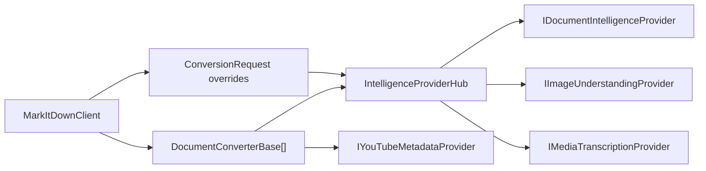

# ADR-0004: Extensible Provider and Converter Abstractions

Status: Implemented  
Date: 2026-02-19  
Related Features: `docs/Features/format-detection-and-converter-routing.md`, `docs/Features/media-and-image-intelligence-enrichment.md`, `docs/Features/youtube-url-metadata-conversion.md`  
Supersedes: none  
Superseded by: none

---

## Implementation plan (step-by-step)

- [x] Analyze converter/provider abstraction layers
- [x] Document contract-first extension strategy
- [x] Capture routing and provider override behavior
- [x] Link verification coverage

---

## Context

- The platform needs to support many document/media/web formats and cloud providers.
- New integrations must be added without rewriting core orchestration.
- Goal: keep conversion and intelligence integrations behind contracts so routing/composition remains stable.
- Non-goal: hard-code provider-specific behavior into core APIs.

---

## Stakeholders (who needs this to be clear)

| Role | What they need to know | Questions this ADR must answer |
| --- | --- | --- |
| Product / Owner | Fast support for new formats/providers | Can we add integrations with low core risk? |
| Engineering | Extension points and boundaries | Where do new converters/providers plug in? |
| DevOps / SRE | Safe provider configuration handling | How are provider overrides resolved per request? |
| QA | Test strategy for extensibility and regressions | How do we validate new integrations safely? |

---

## Decision

Adopt contract-first extensibility using converter and provider interfaces, with central orchestration in `MarkItDownClient` for registration, routing, and per-request override resolution.

Key points:

- Format handlers implement `DocumentConverterBase` (often via pipeline base classes).
- Intelligence integrations implement provider interfaces (`IDocumentIntelligenceProvider`, `IImageUnderstandingProvider`, `IMediaTranscriptionProvider`, `IYouTubeMetadataProvider`).
- Per-request provider overrides are represented in `ConversionRequest` and resolved centrally.

---

## Diagram

---

## Alternatives considered

### Option A: Hard-coded converter/provider dependencies in core

- Pros: fewer abstraction layers
- Cons: brittle coupling, difficult testing and extension
- Rejected because: blocks scalable format/provider growth.

### Option B: Plugin loading via reflection-only runtime discovery

- Pros: very dynamic plugin model
- Cons: opaque failure modes, weaker compile-time guarantees
- Rejected because: current project favors explicit registration and typed contracts.

---

## Consequences

### Positive

- Clear extension seams for new converters/providers.
- Stronger testability via interface-based stubs and integration suites.
- Centralized routing/override logic reduces duplication.

### Negative / risks

- More abstractions increase onboarding complexity.
- Misconfigured provider overrides can cause runtime routing surprises.
- Mitigation: keep architecture docs/feature specs and acceptance tests current.

---

## Impact

### Code

- Affected modules / services: `Core`, `Converters`, `Intelligence`, DI builder.
- New boundaries / responsibilities: core orchestrates; converters/providers implement contracts.
- Feature flags / toggles: provider selection controlled via options + `ConversionRequest`.

### Data / configuration

- Data model / schema changes: none.
- Config changes: provider configs in `MarkItDownOptions` and request-level override models.
- Backwards compatibility strategy: preserve public API overloads and default behaviors.

### Documentation

- Feature docs to update: routing, media enrichment, YouTube conversion.
- Testing docs to update: provider and converter acceptance mapping.
- Architecture docs to update: interfaces/contracts map.
- `docs/Architecture/Overview.md` updates: keep contracts and modules linked.
- Notes for `AGENTS.md`: keep rules against silent fallback and test-only abstractions in core.

---

## Verification

### Objectives

- Prove converter registration/routing works for supported inputs.
- Prove provider override resolution works per request.
- Prove failures surface contract-level diagnostics.

### Test environment

- Environment: local .NET + in-repo fixtures.
- Data/reset strategy: fixture-based tests + provider stubs.
- External dependencies: optional for live integration tests.

### Test commands

- build: `dotnet build MarkItDown.slnx`
- test: `dotnet test MarkItDown.slnx`
- format: `dotnet format MarkItDown.slnx`
- coverage: `dotnet test MarkItDown.slnx --collect:"XPlat Code Coverage"`

### New or changed tests

| ID | Scenario | Level (Unit / Int / API / UI) | Expected result | Notes / Data |
| --- | --- | --- | --- | --- |
| TST-001 | Converter acceptance and routing matrix | Integration | Correct converter path selected by input metadata | `tests/MarkItDown.Tests/ConverterAcceptanceTests.cs` |
| TST-002 | Provider failures and overrides bubble via conversion errors | Integration | Error contains provider/converter context | `tests/MarkItDown.Tests/MarkItDownTests.cs`, `tests/MarkItDown.Tests/Intelligence/Integration/AzureIntelligenceIntegrationTests.cs` |

### Regression and analysis

- Regression suites: converter acceptance, integration and intelligence suites.
- Static analysis: analyzer-enforced build and CI checks.
- Monitoring during rollout: converter-failure counters and conversion traces.

---

## Rollout and migration

- Migration steps: new formats/providers must implement interfaces and register in client/DI.
- Backwards compatibility: maintain existing API contracts.
- Rollback: remove problematic converter/provider registration and revert abstraction changes.

---

## References

- `src/MarkItDown/Converters/DocumentConverterBase.cs`
- `src/MarkItDown/Core/MarkItDownClient.cs`
- `src/MarkItDown/Conversion/ConversionRequest.cs`
- `src/MarkItDown/Intelligence/IntelligenceProviderHub.cs`
- `src/MarkItDown/YouTube/IYouTubeMetadataProvider.cs`
