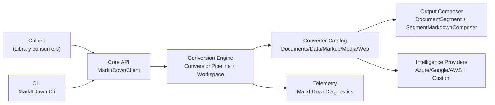
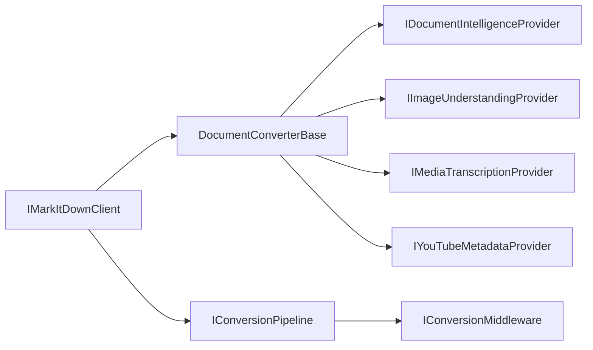
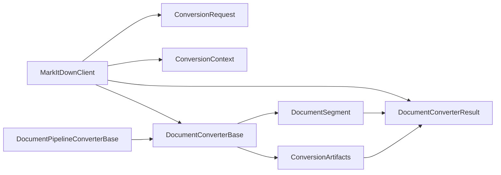

# Architecture Overview

Goal: in ~5 minutes, understand what exists, where it lives, and how modules interact.

This file is the primary "start here" card for humans and AI agents.

Single source of truth: keep this doc navigational and coarse (diagrams + links). Detailed behaviour belongs in `docs/Features/*`; detailed decisions and invariants belong in `docs/ADR/*`.

## Summary

- **System:** `ManagedCode.MarkItDown` is a .NET 10 conversion platform that transforms files/URLs into structured Markdown (`DocumentConverterResult`) with segment/artifact metadata.
- **Where is the code:** core library in `src/MarkItDown/`, CLI host in `src/MarkItDown.Cli/`, tests in `tests/MarkItDown.Tests/`.
- **Entry points:** `MarkItDownClient` (`src/MarkItDown/Core/MarkItDownClient.cs`) and CLI `Program` (`src/MarkItDown.Cli/Program.cs`).
- **Dependencies:** converter abstraction + conversion pipeline + optional intelligence providers + telemetry.

## Scoping (read first)

- **In scope:** file/stream/URL conversion flow, converter routing, segment/artifact output, middleware enrichment, AI provider integration.
- **Out of scope:** NuGet publishing/release mechanics and repository governance beyond conversion behaviour.
- Pick impacted modules from the diagrams/index below.
- Pick entry points first (`MarkItDownClient` or CLI path).
- Read only linked ADRs/feature docs and minimal code paths needed for the change.
- If scope cannot be mapped from this file, update this file first.

## 2) Diagrams (Mermaid)

### 2.1 System / module map

### 2.2 Interfaces / contracts map

### 2.3 Key classes / types map

## 3) Navigation index

### 3.1 Modules (diagram nodes)

- `Core API` — code: [`src/MarkItDown/Core/`](../../src/MarkItDown/Core/); entry points: [`src/MarkItDown/Core/MarkItDownClient.cs`](../../src/MarkItDown/Core/MarkItDownClient.cs), [`src/MarkItDown/Core/IMarkItDownClient.cs`](../../src/MarkItDown/Core/IMarkItDownClient.cs); docs: [`docs/Features/format-detection-and-converter-routing.md`](../Features/format-detection-and-converter-routing.md)
- `Conversion Engine` — code: [`src/MarkItDown/Conversion/`](../../src/MarkItDown/Conversion/); docs: [`docs/Features/disk-first-conversion-pipeline.md`](../Features/disk-first-conversion-pipeline.md), [`docs/ADR/ADR-0001-disk-first-workspace-pipeline.md`](../ADR/ADR-0001-disk-first-workspace-pipeline.md)
- `Converter Catalog` — code: [`src/MarkItDown/Converters/`](../../src/MarkItDown/Converters/); docs: [`docs/Features/structured-docx-pdf-conversion.md`](../Features/structured-docx-pdf-conversion.md), [`docs/Features/youtube-url-metadata-conversion.md`](../Features/youtube-url-metadata-conversion.md)
- `Output Composer` — code: [`src/MarkItDown/Segments/`](../../src/MarkItDown/Segments/); docs: [`docs/ADR/ADR-0003-segment-metadata-contract-for-markdown.md`](../ADR/ADR-0003-segment-metadata-contract-for-markdown.md), [`docs/MetaMD.md`](../MetaMD.md)
- `Intelligence Providers` — code: [`src/MarkItDown/Intelligence/`](../../src/MarkItDown/Intelligence/); docs: [`docs/Features/media-and-image-intelligence-enrichment.md`](../Features/media-and-image-intelligence-enrichment.md), [`docs/ADR/ADR-0004-extensible-provider-and-converter-abstractions.md`](../ADR/ADR-0004-extensible-provider-and-converter-abstractions.md)
- `CLI` — code: [`src/MarkItDown.Cli/`](../../src/MarkItDown.Cli/); entry points: [`src/MarkItDown.Cli/Program.cs`](../../src/MarkItDown.Cli/Program.cs), [`src/MarkItDown.Cli/InteractiveCli.cs`](../../src/MarkItDown.Cli/InteractiveCli.cs)

### 3.2 Interfaces / contracts (diagram edges)

- `Public conversion API` (`IMarkItDownClient`) — source: [`src/MarkItDown/Core/IMarkItDownClient.cs`](../../src/MarkItDown/Core/IMarkItDownClient.cs); caller: library consumers + CLI; docs: [`docs/Features/disk-first-conversion-pipeline.md`](../Features/disk-first-conversion-pipeline.md)
- `Converter contract` (`DocumentConverterBase`) — source: [`src/MarkItDown/Converters/DocumentConverterBase.cs`](../../src/MarkItDown/Converters/DocumentConverterBase.cs); producer: `MarkItDownClient`; consumers: all converter modules; docs: [`docs/ADR/ADR-0004-extensible-provider-and-converter-abstractions.md`](../ADR/ADR-0004-extensible-provider-and-converter-abstractions.md)
- `Middleware contract` (`IConversionPipeline` + `IConversionMiddleware`) — source: [`src/MarkItDown/Conversion/IConversionPipeline.cs`](../../src/MarkItDown/Conversion/IConversionPipeline.cs), [`src/MarkItDown/Conversion/IConversionMiddleware.cs`](../../src/MarkItDown/Conversion/IConversionMiddleware.cs); docs: [`docs/ADR/ADR-0002-middleware-first-enrichment-orchestration.md`](../ADR/ADR-0002-middleware-first-enrichment-orchestration.md)
- `Intelligence provider contracts` — source: [`src/MarkItDown/Intelligence/IDocumentIntelligenceProvider.cs`](../../src/MarkItDown/Intelligence/IDocumentIntelligenceProvider.cs), [`src/MarkItDown/Intelligence/IImageUnderstandingProvider.cs`](../../src/MarkItDown/Intelligence/IImageUnderstandingProvider.cs), [`src/MarkItDown/Intelligence/IMediaTranscriptionProvider.cs`](../../src/MarkItDown/Intelligence/IMediaTranscriptionProvider.cs); docs: [`docs/Features/media-and-image-intelligence-enrichment.md`](../Features/media-and-image-intelligence-enrichment.md)
- `YouTube metadata contract` (`IYouTubeMetadataProvider`) — source: [`src/MarkItDown/YouTube/IYouTubeMetadataProvider.cs`](../../src/MarkItDown/YouTube/IYouTubeMetadataProvider.cs); consumer: `YouTubeUrlConverter`; docs: [`docs/Features/youtube-url-metadata-conversion.md`](../Features/youtube-url-metadata-conversion.md)

### 3.3 Key classes / types (high-signal)

- `MarkItDownClient` — defined in [`src/MarkItDown/Core/MarkItDownClient.cs`](../../src/MarkItDown/Core/MarkItDownClient.cs); orchestrates detection, converter selection, pipeline and telemetry.
- `StreamInfo` — defined in [`src/MarkItDown/Core/StreamInfo.cs`](../../src/MarkItDown/Core/StreamInfo.cs); drives MIME/extension/url-based converter routing.
- `ConversionRequest` — defined in [`src/MarkItDown/Conversion/ConversionRequest.cs`](../../src/MarkItDown/Conversion/ConversionRequest.cs); per-call pipeline/intelligence overrides.
- `DocumentPipelineConverterBase` — defined in [`src/MarkItDown/Converters/Base/DocumentPipelineConverterBase.cs`](../../src/MarkItDown/Converters/Base/DocumentPipelineConverterBase.cs); disk-first source materialization + workspace helpers.
- `ConversionPipeline` — defined in [`src/MarkItDown/Conversion/ConversionPipeline.cs`](../../src/MarkItDown/Conversion/ConversionPipeline.cs); middleware execution chain.
- `DocumentSegment` — defined in [`src/MarkItDown/Segments/DocumentSegment.cs`](../../src/MarkItDown/Segments/DocumentSegment.cs); normalized semantic output unit.
- `SegmentMarkdownComposer` — defined in [`src/MarkItDown/Segments/SegmentMarkdownComposer.cs`](../../src/MarkItDown/Segments/SegmentMarkdownComposer.cs); final Markdown + front-matter composition.
- `DocumentConverterResult` — defined in [`src/MarkItDown/Core/DocumentConverterResult.cs`](../../src/MarkItDown/Core/DocumentConverterResult.cs); final API payload with markdown, segments and artifacts.

## 4) Dependency rules

- Allowed dependencies:
  - `MarkItDown.Cli` depends on `MarkItDown` only through public APIs.
  - Converters depend on `Core`, `Conversion`, `Segments`, `Intelligence`, and utility abstractions.
  - Intelligence provider implementations depend on provider SDKs behind provider interfaces.
- Forbidden dependencies:
  - `src/MarkItDown/` must not depend on test projects.
  - Converter implementations must not depend on CLI types.
  - Test-only abstractions must not be introduced into production core.
- Integration style: synchronous converter selection + async conversion/middleware execution; provider calls abstracted by interfaces.
- Shared code policy: common flow lives in base converters and shared pipeline modules; format-specific behaviour stays in converter folders.

## 5) Key decisions (ADRs)

- [`docs/ADR/ADR-0001-disk-first-workspace-pipeline.md`](../ADR/ADR-0001-disk-first-workspace-pipeline.md) — persist sources/artifacts to disk workspace before conversion stages.
- [`docs/ADR/ADR-0002-middleware-first-enrichment-orchestration.md`](../ADR/ADR-0002-middleware-first-enrichment-orchestration.md) — run enrichment/telemetry through ordered middleware after extraction.
- [`docs/ADR/ADR-0003-segment-metadata-contract-for-markdown.md`](../ADR/ADR-0003-segment-metadata-contract-for-markdown.md) — enforce ordered segment metadata contract for stable MetaMD output.
- [`docs/ADR/ADR-0004-extensible-provider-and-converter-abstractions.md`](../ADR/ADR-0004-extensible-provider-and-converter-abstractions.md) — keep provider/converter integrations behind pluggable interfaces.

## 6) Where to go next

- Decisions: [`docs/ADR/`](../ADR/)
- Behaviour specs: [`docs/Features/`](../Features/)
- Canonical pipeline details: [`docs/DocumentProcessingPipeline.md`](../DocumentProcessingPipeline.md)
- Markdown output contract: [`docs/MetaMD.md`](../MetaMD.md)
- How to run and verify: [`docs/Development/CI.md`](../Development/CI.md), [`docs/Testing/Overview.md`](../Testing/Overview.md)
