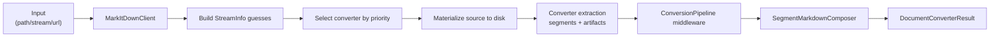

# Feature: Disk-First Conversion Pipeline

Links:  
Architecture: `docs/Architecture/Overview.md`  
Modules: `src/MarkItDown/Core`, `src/MarkItDown/Conversion`, `src/MarkItDown/Converters/Base`  
ADRs: `docs/ADR/ADR-0001-disk-first-workspace-pipeline.md`, `docs/ADR/ADR-0002-middleware-first-enrichment-orchestration.md`

---

## Implementation plan (step-by-step)

- [x] Analyze current behaviour and code paths
- [x] Capture scope, flow, invariants, and verification
- [x] Map feature behaviour to automated tests
- [x] Link architecture and ADR references

---

## Purpose

Provide deterministic conversion of files/streams/URLs by persisting input to disk first, then running converter extraction and middleware on file-backed sources. This prevents hidden `MemoryStream` bottlenecks for large inputs and gives stable artifact persistence.

---

## Stakeholders (who needs this to be clear)

| Role | What they need from this spec |
| --- | --- |
| Product / Owner | Reliable conversion for large documents |
| Engineering | Clear pipeline sequence and extension points |
| DevOps / SRE | Predictable temp storage, cleanup, and telemetry |
| QA | End-to-end flows validating disk-backed conversion |

---

## Scope

### In scope

- File/stream/URI entry points in `MarkItDownClient`
- Disk materialization in base converter abstractions
- Workspace/artifact persistence and middleware execution order

### Out of scope

- NuGet release/publishing process
- CLI UX decisions not affecting conversion semantics

---

## Business Rules

- Every conversion path must operate on persisted file-backed inputs (no core conversion path based on `MemoryStream`).
- Converter extraction happens before conversion middleware.
- Markdown is composed from ordered segments/artifacts after middleware has completed.
- Conversion output must include metadata/artifacts needed for downstream RAG and diagnostics.

---

## User Flows

### Primary flows

1. Convert a local file path  
   - Actor: library caller or CLI  
   - Trigger: `ConvertAsync(path)`  
   - Steps: resolve `StreamInfo` -> detect format guesses -> select converter -> materialize/extract -> execute middleware -> compose Markdown  
   - Result: `DocumentConverterResult` with markdown + segments + artifacts.

2. Convert a URL/URI  
   - Actor: library caller  
   - Trigger: `ConvertFromUrlAsync` / `ConvertUriAsync`  
   - Steps: download/resolve source -> persist locally -> run same conversion pipeline  
   - Result: same output contract as local files.

### Edge cases

- Large/binary/unknown payloads -> unsupported format with converter failure details.
- Converter throws during extraction -> surfaced in aggregated exception and diagnostics.
- Middleware enrichment fails for one artifact -> governed by middleware policy (soft/hard fail depending on middleware).

---

## System Behaviour

- Entry points: `MarkItDownClient`, CLI `ConversionService`
- Reads from: local file system, URI sources, configuration/options
- Writes to: conversion artifacts, markdown output, telemetry spans/counters
- Side effects / emitted events: conversion progress notifications, logging, telemetry metrics
- Idempotency: deterministic per input/options set
- Error handling: wraps converter failures in `UnsupportedFormatException` with aggregated details
- Security / permissions: caller controls source location and configured providers
- Feature flags / toggles: `ConversionRequest.Pipeline`, `SegmentOptions`, intelligence overrides
- Performance / SLAs: disk-first behavior avoids large managed memory spikes
- Observability: `MarkItDownDiagnostics` activity and counters

---

## Diagrams

---

## Verification

### Test environment

- Environment / stack: local .NET SDK, file-backed test assets under `tests/MarkItDown.Tests/TestFiles`
- Data and reset strategy: deterministic fixture files + generated catalog
- External dependencies: only required for live integration suites

### Test commands

- build: `dotnet build MarkItDown.slnx`
- test: `dotnet test MarkItDown.slnx`
- format: `dotnet format MarkItDown.slnx`
- coverage: `dotnet test MarkItDown.slnx --collect:"XPlat Code Coverage"`

### Test flows

**Positive scenarios**

| ID | Description | Level (Unit / Int / API / UI) | Expected result | Data / Notes |
| --- | --- | --- | --- | --- |
| POS-001 | Convert known fixtures through the public client | Integration | Markdown returned with segments/artifacts | `tests/MarkItDown.Tests/MarkItDownIntegrationTests.cs` |
| POS-002 | Workspace paths and artifacts are created/persisted correctly | Integration | Artifact workspace behaves as configured | `tests/MarkItDown.Tests/Conversion/ArtifactWorkspaceFactoryTests.cs` |

**Negative scenarios**

| ID | Description | Level (Unit / Int / API / UI) | Expected result | Data / Notes |
| --- | --- | --- | --- | --- |
| NEG-001 | Unsupported or failing converter chain | Integration | `UnsupportedFormatException` with failure details | `tests/MarkItDown.Tests/MarkItDownTests.cs` |

**Edge cases**

| ID | Description | Level (Unit / Int / API / UI) | Expected result | Data / Notes |
| --- | --- | --- | --- | --- |
| EDGE-001 | Non-seekable input stream | Integration | Conversion still succeeds via disk buffering | `tests/MarkItDown.Tests/MarkItDownTests.cs` |

### Test mapping

- Integration tests: `tests/MarkItDown.Tests/MarkItDownIntegrationTests.cs`, `tests/MarkItDown.Tests/Conversion/ArtifactWorkspaceFactoryTests.cs`
- API tests: N/A (library API, no HTTP server)
- UI / E2E tests: N/A
- Unit tests: converter-specific suites under `tests/MarkItDown.Tests/*Tests.cs`
- Static analysis: analyzers enabled via `Directory.Build.props` and enforced during build

---

## Definition of Done

- Pipeline flow matches this spec.
- Tests cover positive, negative, and edge behavior.
- Commands above run in local/CI contexts.
- Architecture/ADR links remain current.

---

## References

- `src/MarkItDown/Core/MarkItDownClient.cs`
- `src/MarkItDown/Converters/Base/DocumentPipelineConverterBase.cs`
- `src/MarkItDown/Conversion/ConversionPipeline.cs`
- `docs/DocumentProcessingPipeline.md`
