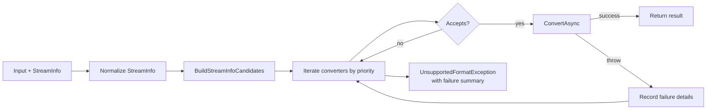

# Feature: Format Detection and Converter Routing

Links:  
Architecture: `docs/Architecture/Overview.md`  
Modules: `src/MarkItDown/Core`, `src/MarkItDown/Converters`  
ADRs: `docs/ADR/ADR-0004-extensible-provider-and-converter-abstractions.md`

---

## Implementation plan (step-by-step)

- [x] Analyze StreamInfo normalization and guess generation
- [x] Document converter ordering and acceptance contracts
- [x] Capture failure-reporting behavior
- [x] Link routing behavior to tests

---

## Purpose

Select the correct converter for each input by combining explicit metadata (mime/extension/url/path) with content sniffing, while preserving deterministic priority order and actionable diagnostics when routing fails.

---

## Stakeholders (who needs this to be clear)

| Role | What they need from this spec |
| --- | --- |
| Product / Owner | Stable conversion behavior for supported formats |
| Engineering | Predictable converter selection rules |
| DevOps / SRE | Clear errors/telemetry when no converter succeeds |
| QA | Routing tests for extension, MIME, and URL combinations |

---

## Scope

### In scope

- `StreamInfo` normalization and MIME resolution
- Candidate generation (`BuildStreamInfoCandidates`)
- Converter acceptance and priority ordering
- Converter failure diagnostics

### Out of scope

- Internal parsing logic of each converter
- External provider auth/network behaviors

---

## Business Rules

- Converter selection uses ordered registrations by priority.
- A converter must explicitly accept input (`Accepts`/`AcceptsInput`) before conversion.
- If all converters fail, user receives `UnsupportedFormatException` with converter failure details, except authorization/authentication failures which surface as `FileConversionException`.
- Media uploads (`audio/*`, `video/*`) must stay on media/file converter paths and must not be routed through YouTube URL converter logic.
- `video/*` files route through `VideoConverter` first, then use configured media transcription providers (for example Azure Video Indexer) via the media converter flow.

---

## User Flows

### Primary flows

1. Upload a known file (`.pdf`, `.docx`, `.mp4`)  
   - Actor: library caller / CLI  
   - Trigger: conversion API call  
   - Steps: normalize stream info -> generate guesses -> iterate converter list -> convert first matching converter  
   - Result: expected converter selected and result returned.

2. Convert URL input  
   - Actor: library caller  
   - Trigger: URL conversion API call  
   - Steps: download -> create URL-aware stream info -> same routing pipeline  
   - Result: web/media/url converter path selected by input type.

### Edge cases

- Incorrect extension but detectable MIME/content -> fallback guess can still route to supported converter.
- Converter throws -> next converter attempt continues, failures aggregated.
- Ambiguous URL+MIME inputs -> media safety rules prevent incorrect YouTube converter usage for uploaded media.

---

## System Behaviour

- Entry points: `MarkItDownClient.ConvertAsync/ConvertFromUrlAsync/ConvertUriAsync`
- Reads from: stream metadata + detected content MIME
- Writes to: progress updates, logs, telemetry counters, aggregated exceptions
- Side effects / emitted events: `ConversionProgress` stages (`trying-converter`, `converter-selected`, `converter-failed`)
- Idempotency: deterministic for same registration order and input metadata
- Error handling: aggregated converter failures in final unsupported format exception, with auth failures promoted to `FileConversionException`
- Security / permissions: no privileged operations beyond source access and configured provider calls
- Feature flags / toggles: parallel converter evaluation options in `ConversionRequest.Pipeline`
- Performance / SLAs: optional parallel evaluation by priority group
- Observability: converter failure counters by converter/mime/extension

---

## Diagrams

---

## Verification

### Test environment

- Environment / stack: local .NET SDK and xUnit test suites
- Data and reset strategy: in-repo fixtures + generated test asset catalog
- External dependencies: none for routing unit/integration tests

### Test commands

- build: `dotnet build MarkItDown.slnx`
- test: `dotnet test MarkItDown.slnx`
- format: `dotnet format MarkItDown.slnx`
- coverage: `dotnet test MarkItDown.slnx --collect:"XPlat Code Coverage"`

### Test flows

**Positive scenarios**

| ID | Description | Level (Unit / Int / API / UI) | Expected result | Data / Notes |
| --- | --- | --- | --- | --- |
| POS-001 | MIME/extension normalization resolves expected type | Unit | Correct normalized `StreamInfo` values | `tests/MarkItDown.Tests/StreamInfoDetectionTests.cs` |
| POS-002 | Known format routes to expected converter | Integration | Conversion succeeds with expected markdown | `tests/MarkItDown.Tests/ConverterAcceptanceTests.cs` |

**Negative scenarios**

| ID | Description | Level (Unit / Int / API / UI) | Expected result | Data / Notes |
| --- | --- | --- | --- | --- |
| NEG-001 | Converter throws during routing | Integration | Failure detail included and aggregate exception preserved | `tests/MarkItDown.Tests/MarkItDownTests.cs` |
| NEG-002 | Provider auth failure during routing | Integration | `FileConversionException` returned with auth context | `tests/MarkItDown.Tests/MarkItDownTests.cs` |

**Edge cases**

| ID | Description | Level (Unit / Int / API / UI) | Expected result | Data / Notes |
| --- | --- | --- | --- | --- |
| EDGE-001 | YouTube URL with media MIME on uploaded stream | Integration | YouTube metadata provider is not invoked for media-upload path | `tests/MarkItDown.Tests/ConverterAcceptanceTests.cs` |

### Test mapping

- Integration tests: `tests/MarkItDown.Tests/ConverterAcceptanceTests.cs`, `tests/MarkItDown.Tests/MarkItDownTests.cs`
- API tests: N/A
- UI / E2E tests: N/A
- Unit tests: `tests/MarkItDown.Tests/StreamInfoDetectionTests.cs`
- Static analysis: analyzers in build, warnings treated as errors

---

## Definition of Done

- Routing rules and guardrails are documented and test-backed.
- Converter selection failures are diagnosable.
- Media safety routing constraints are explicit.

---

## References

- `src/MarkItDown/Core/StreamInfo.cs`
- `src/MarkItDown/Core/MarkItDownClient.cs`
- `src/MarkItDown/Converters/Media/YouTubeUrlConverter.cs`
- `tests/MarkItDown.Tests/StreamInfoDetectionTests.cs`
