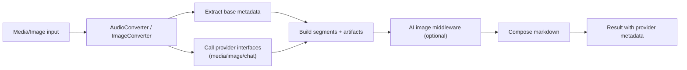

# Feature: Media and Image Intelligence Enrichment

Links:  
Architecture: `docs/Architecture/Overview.md`  
Modules: `src/MarkItDown/Converters/Media`, `src/MarkItDown/Intelligence`, `src/MarkItDown/Conversion/Middleware`  
ADRs: `docs/ADR/ADR-0002-middleware-first-enrichment-orchestration.md`, `docs/ADR/ADR-0004-extensible-provider-and-converter-abstractions.md`

---

## Implementation plan (step-by-step)

- [x] Analyze audio/image converter enrichment flow
- [x] Document provider abstraction behavior and failure rules
- [x] Capture image chat enrichment expectations and output policy
- [x] Link to tests and live integration suites

---

## Purpose

Enable richer media conversion by combining baseline metadata extraction with optional provider-driven intelligence (transcription, OCR, image understanding, AI chat enrichment) while preserving deterministic markdown output contracts.

---

## Stakeholders (who needs this to be clear)

| Role | What they need from this spec |
| --- | --- |
| Product / Owner | Better media understanding in markdown output |
| Engineering | Provider invocation rules and failure semantics |
| DevOps / SRE | Cloud provider configuration and observability expectations |
| QA | Confidence that enrichment behavior is covered in tests |

---

## Scope

### In scope

- `AudioConverter` transcription and metadata flow
- `VideoConverter` routing for `video/*` inputs
- `ImageConverter` metadata/caption flow
- AI image enrichment middleware/chat enrichment flow
- Provider abstraction interfaces and request overrides

### Out of scope

- UI presentation of enriched media content
- Provider-specific billing/governance policies

---

## Business Rules

- Missing required media provider configurations must surface explicit failures instead of silent fallback.
- Video Indexer processing must wait for `Processed` and fail with a clear timeout/config error if processing does not complete in the configured window.
- Image enrichment must reject missing MIME metadata and preserve one canonical image placeholder/description path in final markdown.
- If AI image enrichment returns no insight, treat it as soft failure (log and continue).
- Media routing must avoid YouTube converter path for uploaded `audio/*` or `video/*` media.
- Video transcript output must include rich context (timing/speaker/sentiment/topics/keywords plus Video Indexer state/index/progress metadata when available).

---

## User Flows

### Primary flows

1. Convert an audio/video file with media transcription enabled  
   - Actor: library caller  
   - Trigger: media conversion request with provider options  
   - Steps: route `video/*` to `VideoConverter`/`AudioConverter` -> extract metadata -> upload/poll provider -> build transcript + analysis segments -> compose markdown  
   - Result: markdown containing metadata and transcript segments.

2. Convert an image with AI enrichment enabled  
   - Actor: library caller  
   - Trigger: image conversion path + AI provider availability  
   - Steps: extract image metadata/artifact -> run understanding/chat enrichment -> produce final placeholder + description markdown  
   - Result: markdown and artifacts enriched with OCR/caption insight.

### Edge cases

- Provider auth failure -> converter failure surfaced as `FileConversionException` with auth context.
- Video Indexer processing timeout -> conversion fails with last known state/progress in the error.
- No transcript segments for required media request -> hard failure.
- Empty image chat response -> log and keep baseline image output.

---

## System Behaviour

- Entry points: media/image converter selection via `MarkItDownClient`
- Reads from: source media files and provider outputs
- Writes to: audio/image segments, artifact metadata, provider metadata markers
- Side effects / emitted events: optional remote provider calls, logs/telemetry
- Idempotency: deterministic absent provider-side nondeterminism
- Error handling: explicit `FileConversionException` for required provider failures
- Security / permissions: provider credentials from options/request overrides
- Feature flags / toggles: segment options + per-request intelligence overrides
- Performance / SLAs: disk-backed input and persisted artifacts mitigate memory pressure
- Observability: converter failure details, media transcription activity tags, and provider/video index metadata

---

## Diagrams

---

## Verification

### Test environment

- Environment / stack: local tests with stubs + optional live provider integration
- Data and reset strategy: fixture media files in test catalog
- External dependencies: live tests require provider credentials and network access

### Test commands

- build: `dotnet build MarkItDown.slnx`
- test: `dotnet test MarkItDown.slnx`
- format: `dotnet format MarkItDown.slnx`
- coverage: `dotnet test MarkItDown.slnx --collect:"XPlat Code Coverage"`

### Test flows

**Positive scenarios**

| ID | Description | Level (Unit / Int / API / UI) | Expected result | Data / Notes |
| --- | --- | --- | --- | --- |
| POS-001 | Audio converter emits metadata/transcript segments | Integration | Transcript section and metadata returned | `tests/MarkItDown.Tests/AudioConverterTests.cs` |
| POS-002 | Image chat enrichment populates insights | Integration | Enrichment content added to artifacts/markdown | `tests/MarkItDown.Tests/Intelligence/ImageChatEnricherTests.cs` |

**Negative scenarios**

| ID | Description | Level (Unit / Int / API / UI) | Expected result | Data / Notes |
| --- | --- | --- | --- | --- |
| NEG-001 | Required media provider fails | Integration | Error surfaced with provider context | `tests/MarkItDown.Tests/MarkItDownTests.cs` |
| NEG-002 | Missing MIME metadata for AI image enrichment | Integration | Failure surfaced instead of fallback MIME | `tests/MarkItDown.Tests/Intelligence/ImageChatEnricherTests.cs` |

**Edge cases**

| ID | Description | Level (Unit / Int / API / UI) | Expected result | Data / Notes |
| --- | --- | --- | --- | --- |
| EDGE-001 | Video media input with URL metadata | Integration | Routed through media path, not YouTube metadata path | `tests/MarkItDown.Tests/ConverterAcceptanceTests.cs` |
| EDGE-002 | Live Azure media transcription path | Integration (live) | Provider transcript segments marked as azure video indexer with transcript + analysis sections | `tests/MarkItDown.Tests/Intelligence/Integration/AzureIntelligenceIntegrationTests.cs` |

### Test mapping

- Integration tests: `tests/MarkItDown.Tests/AudioConverterTests.cs`, `tests/MarkItDown.Tests/Intelligence/ImageChatEnricherTests.cs`, `tests/MarkItDown.Tests/ConverterAcceptanceTests.cs`
- API tests: N/A
- UI / E2E tests: N/A
- Unit tests: provider and helper-specific test cases under `tests/MarkItDown.Tests/Intelligence/*`
- Static analysis: analyzers enforced during build

---

## Definition of Done

- Media/image enrichment contract is explicit and test-backed.
- Failure policy for provider errors is documented and enforced.
- Live integration suites and skip/fail conditions are documented.

---

## References

- `src/MarkItDown/Converters/Media/AudioConverter.cs`
- `src/MarkItDown/Converters/Media/VideoConverter.cs`
- `src/MarkItDown/Converters/Media/ImageConverter.cs`
- `src/MarkItDown/Intelligence/Providers/Azure/VideoIndexer/VideoIndexerClient.cs`
- `src/MarkItDown/Intelligence/ImageChatEnricher.cs`
- `tests/MarkItDown.Tests/AudioConverterTests.cs`
- `tests/MarkItDown.Tests/Intelligence/ImageChatEnricherTests.cs`
