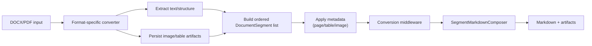

# Feature: Structured DOCX and PDF Conversion

Links:  
Architecture: `docs/Architecture/Overview.md`  
Modules: `src/MarkItDown/Converters/Documents/Docx`, `src/MarkItDown/Converters/Documents/PdfConverter.cs`, `src/MarkItDown/Segments`  
ADRs: `docs/ADR/ADR-0001-disk-first-workspace-pipeline.md`, `docs/ADR/ADR-0003-segment-metadata-contract-for-markdown.md`

---

## Implementation plan (step-by-step)

- [x] Analyze DOCX/PDF converter extraction flow
- [x] Capture segmentation/table/image behavior
- [x] Link feature behavior with existing tests
- [x] Align with MetaMD output contract docs

---

## Purpose

Convert Word and PDF documents into high-fidelity Markdown while preserving structure (headings, paragraphs, tables, images, page boundaries) and producing metadata-rich segments/artifacts for downstream processing.

---

## Stakeholders (who needs this to be clear)

| Role | What they need from this spec |
| --- | --- |
| Product / Owner | Predictable readable output for complex documents |
| Engineering | Rules for table/image/page extraction and ordering |
| DevOps / SRE | Resource and provider behavior for large docs |
| QA | Regression tests for layout-sensitive conversions |

---

## Scope

### In scope

- DOCX converter partial implementation
- PDF converter text/image page behavior
- Segment/table metadata shaping for Markdown composition

### Out of scope

- Non-DOCX/PDF converters
- UI rendering concerns of markdown consumers

---

## Business Rules

- Output segments must preserve source order with explicit page/segment metadata.
- Multi-page tables must include continuation markers and `table.pageStart`, `table.pageEnd`, `table.pageRange` metadata.
- When configured, PDF pages can be treated as images and routed through OCR/vision enrichment while retaining page context.
- Extracted images and table artifacts must be persisted and surfaced in artifact metadata.

---

## User Flows

### Primary flows

1. Convert DOCX with mixed text/tables/images  
   - Actor: library caller  
   - Trigger: DOCX conversion API call  
   - Steps: materialize file -> parse OpenXML content -> persist image artifacts -> build ordered segments -> run middleware -> compose Markdown  
   - Result: markdown with preserved structure and artifact references.

2. Convert PDF with standard text extraction  
   - Actor: library caller  
   - Trigger: PDF conversion API call  
   - Steps: parse pages -> detect tables/images -> build page segments -> middleware -> compose Markdown  
   - Result: markdown with page-oriented segments and metadata.

### Edge cases

- PDF with minimal selectable text -> optional page-as-image mode captures OCR/vision text.
- Table spans page break -> continuation comments + table page-range metadata.
- Image enrichment unavailable -> base conversion still returns stable markdown/artifacts.

---

## System Behaviour

- Entry points: `MarkItDownClient` with DOCX/PDF stream info
- Reads from: OpenXML/PDF data, provider outputs (optional)
- Writes to: ordered document segments, text/table/image artifacts
- Side effects / emitted events: conversion progress + telemetry
- Idempotency: deterministic for same file/options/provider outputs
- Error handling: converter exceptions surfaced as file conversion failures
- Security / permissions: follows configured provider credentials only
- Feature flags / toggles: `SegmentOptions.Pdf.TreatPagesAsImages`, document/image intelligence options
- Performance / SLAs: disk-first processing and artifact persistence for large files
- Observability: conversion timing + failure counters

---

## Diagrams

---

## Verification

### Test environment

- Environment / stack: local .NET + fixture files under `tests/MarkItDown.Tests/TestFiles`
- Data and reset strategy: fixture-backed deterministic tests
- External dependencies: optional providers stubbed in non-live tests

### Test commands

- build: `dotnet build MarkItDown.slnx`
- test: `dotnet test MarkItDown.slnx`
- format: `dotnet format MarkItDown.slnx`
- coverage: `dotnet test MarkItDown.slnx --collect:"XPlat Code Coverage"`

### Test flows

**Positive scenarios**

| ID | Description | Level (Unit / Int / API / UI) | Expected result | Data / Notes |
| --- | --- | --- | --- | --- |
| POS-001 | DOCX headings/tables/images convert to markdown | Integration | Structured markdown and artifacts returned | `tests/MarkItDown.Tests/DocxConverterTests.cs` |
| POS-002 | PDF text conversion emits expected sections and artifacts | Integration | Stable markdown output and segment metadata | `tests/MarkItDown.Tests/PdfConverterTests.cs` |

**Negative scenarios**

| ID | Description | Level (Unit / Int / API / UI) | Expected result | Data / Notes |
| --- | --- | --- | --- | --- |
| NEG-001 | Corrupt or unsupported payload in converter path | Integration | Conversion failure surfaced via public API | `tests/MarkItDown.Tests/MarkItDownTests.cs` |

**Edge cases**

| ID | Description | Level (Unit / Int / API / UI) | Expected result | Data / Notes |
| --- | --- | --- | --- | --- |
| EDGE-001 | PDF `TreatPagesAsImages` option enabled | Integration | OCR/vision-enriched page segments emitted | `tests/MarkItDown.Tests/PdfConverterTests.cs` |
| EDGE-002 | Multi-page table metadata continuity | Integration | `table.pageStart/pageEnd/pageRange` metadata preserved | `tests/MarkItDown.Tests/DocxConverterTests.cs` |

### Test mapping

- Integration tests: `tests/MarkItDown.Tests/DocxConverterTests.cs`, `tests/MarkItDown.Tests/PdfConverterTests.cs`
- API tests: N/A
- UI / E2E tests: N/A
- Unit tests: helper-level converter tests inside same suites
- Static analysis: analyzers enforced at build

---

## Definition of Done

- DOCX/PDF conversion behavior and metadata rules are documented.
- Core regression suites cover happy, negative, and edge scenarios.
- Architecture + ADR links for this behavior are current.

---

## References

- `src/MarkItDown/Converters/Documents/Docx/DocxConverter.cs`
- `src/MarkItDown/Converters/Documents/PdfConverter.cs`
- `docs/MetaMD.md`
- `tests/MarkItDown.Tests/DocxConverterTests.cs`
- `tests/MarkItDown.Tests/PdfConverterTests.cs`
