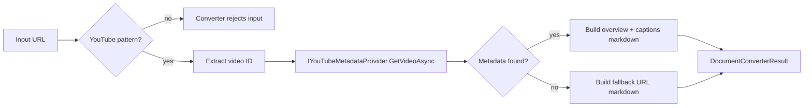

# Feature: YouTube URL Metadata Conversion

Links:  
Architecture: `docs/Architecture/Overview.md`  
Modules: `src/MarkItDown/Converters/Media/YouTubeUrlConverter.cs`, `src/MarkItDown/YouTube`  
ADRs: `docs/ADR/ADR-0004-extensible-provider-and-converter-abstractions.md`

---

## Implementation plan (step-by-step)

- [x] Analyze YouTube URL acceptance and metadata flow
- [x] Document converter/provider contracts and output behavior
- [x] Capture routing boundaries vs media upload converters
- [x] Link behavior to unit and live tests

---

## Purpose

Support direct YouTube URL conversion into markdown by extracting metadata/captions through a pluggable provider, without downloading and transcoding video media content.

---

## Stakeholders (who needs this to be clear)

| Role | What they need from this spec |
| --- | --- |
| Product / Owner | Rich metadata extraction for YouTube links |
| Engineering | Clear URL-matching and provider integration rules |
| DevOps / SRE | Live provider dependency expectations and skip conditions |
| QA | Test coverage for URL forms and metadata outcomes |

---

## Scope

### In scope

- YouTube URL pattern acceptance (`youtube.com/watch`, `youtu.be`)
- Video ID extraction and provider metadata retrieval
- Markdown output for overview, links, optional captions

### Out of scope

- Downloading/transcoding raw video bytes
- Handling generic video file uploads as YouTube URLs

---

## Business Rules

- Converter accepts only valid YouTube URL patterns with extractable video ID.
- Metadata retrieval is delegated to `IYouTubeMetadataProvider`.
- Missing metadata falls back to minimal URL/ID markdown representation.
- Uploaded media files resolving to `audio/*` or `video/*` must route through media converters, not this URL metadata converter.

---

## User Flows

### Primary flows

1. Convert full YouTube URL  
   - Actor: library caller  
   - Trigger: stream info with URL like `https://www.youtube.com/watch?v=...`  
   - Steps: URL regex match -> extract video ID -> provider call -> build markdown and segments  
   - Result: metadata/caption-enriched markdown.

2. Convert shortened YouTube URL  
   - Actor: library caller  
   - Trigger: URL like `https://youtu.be/...`  
   - Steps: same as above with short URL extraction branch  
   - Result: same output contract.

### Edge cases

- Invalid URL format -> unsupported format exception from converter path.
- Provider failure -> file conversion exception with upstream context.
- Provider returns null metadata -> fallback markdown still generated.

---

## System Behaviour

- Entry points: converter selection through `MarkItDownClient`
- Reads from: `StreamInfo.Url` and provider API data
- Writes to: markdown sections, metadata segments, optional caption segments
- Side effects / emitted events: remote metadata provider calls
- Idempotency: deterministic for fixed provider response
- Error handling: wraps unexpected provider errors as file conversion exceptions
- Security / permissions: provider-specific network/auth requirements
- Feature flags / toggles: custom provider injection via `MarkItDownOptions.YouTubeMetadataProvider`
- Performance / SLAs: metadata call latency dominates conversion path
- Observability: converter failure diagnostics in routing output

---

## Diagrams

---

## Verification

### Test environment

- Environment / stack: local tests with stub provider; optional live network test
- Data and reset strategy: deterministic fixture provider responses
- External dependencies: live test depends on YouTube metadata provider availability

### Test commands

- build: `dotnet build MarkItDown.slnx`
- test: `dotnet test MarkItDown.slnx`
- format: `dotnet format MarkItDown.slnx`
- coverage: `dotnet test MarkItDown.slnx --collect:"XPlat Code Coverage"`

### Test flows

**Positive scenarios**

| ID | Description | Level (Unit / Int / API / UI) | Expected result | Data / Notes |
| --- | --- | --- | --- | --- |
| POS-001 | Full and short URL acceptance | Unit | Converter accepts valid URLs | `tests/MarkItDown.Tests/Converters/YouTubeUrlConverterTests.cs` |
| POS-002 | Provider metadata rendered into markdown and segments | Unit/Integration | Title/metadata/captions emitted | `tests/MarkItDown.Tests/Converters/YouTubeUrlConverterTests.cs` |

**Negative scenarios**

| ID | Description | Level (Unit / Int / API / UI) | Expected result | Data / Notes |
| --- | --- | --- | --- | --- |
| NEG-001 | Invalid URL rejected | Unit | Converter does not accept / throws unsupported format | `tests/MarkItDown.Tests/Converters/YouTubeUrlConverterTests.cs` |

**Edge cases**

| ID | Description | Level (Unit / Int / API / UI) | Expected result | Data / Notes |
| --- | --- | --- | --- | --- |
| EDGE-001 | URL present on media-upload stream info | Integration | Media path selected, YouTube provider not called | `tests/MarkItDown.Tests/ConverterAcceptanceTests.cs` |
| EDGE-002 | Live provider smoke test | Integration (live) | Real metadata retrieval works or test skips gracefully | `tests/MarkItDown.Tests/Converters/YouTubeUrlConverterLiveTests.cs` |

### Test mapping

- Integration tests: `tests/MarkItDown.Tests/ConverterAcceptanceTests.cs`, `tests/MarkItDown.Tests/Converters/YouTubeUrlConverterLiveTests.cs`
- API tests: N/A
- UI / E2E tests: N/A
- Unit tests: `tests/MarkItDown.Tests/Converters/YouTubeUrlConverterTests.cs`
- Static analysis: analyzers enforced via build

---

## Definition of Done

- URL routing and metadata behavior are documented.
- Unit + live integration expectations are explicit.
- Media routing boundary against uploaded files is preserved.

---

## References

- `src/MarkItDown/Converters/Media/YouTubeUrlConverter.cs`
- `src/MarkItDown/YouTube/IYouTubeMetadataProvider.cs`
- `tests/MarkItDown.Tests/Converters/YouTubeUrlConverterTests.cs`
- `tests/MarkItDown.Tests/Converters/YouTubeUrlConverterLiveTests.cs`
