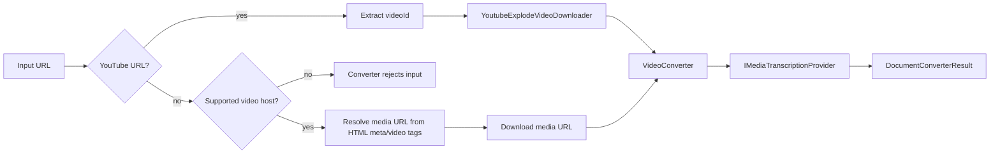

# Feature: Video Platform URL Conversion (YouTube + Supported Hosts)

Links:  
Architecture: `docs/Architecture/Overview.md`  
Modules: `src/MarkItDown/Converters/Media/YouTubeUrlConverter.cs`, `src/MarkItDown/YouTube`  
ADRs: `docs/ADR/ADR-0004-extensible-provider-and-converter-abstractions.md`

---

## Implementation plan (step-by-step)

- [x] Analyze current YouTube URL metadata-only behavior and converter routing
- [x] Switch URL flow to media download + media transcription pipeline
- [x] Add supported non-YouTube video-platform URL resolution (HTML meta/video tags)
- [x] Keep uploaded `audio/*`/`video/*` routing boundary intact
- [x] Update tests and live provider probe coverage

---

## Purpose

Convert YouTube and supported video-platform URLs by resolving and downloading real video media, then processing it through the media converter pipeline (including Azure Video Indexer when configured), instead of relying on caption-only metadata extraction.

---

## Stakeholders (who needs this to be clear)

| Role | What they need from this spec |
| --- | --- |
| Product / Owner | URL conversions reflect actual video/audio content, not only platform captions |
| Engineering | Deterministic URL routing and actionable failures for unresolved media URLs |
| DevOps / SRE | Clear dependency expectations for YouTube/video platform download and media providers |
| QA | Coverage for URL acceptance, downloader routing, and fail-fast non-video responses |

---

## Scope

### In scope

- YouTube URL detection and video ID extraction
- YouTube media stream download via `YoutubeExplodeVideoDownloader`
- Supported non-YouTube host URL resolution via HTML metadata (`og:video`, `twitter:player:stream`, `<video>/<source>`)
- Delegation to media pipeline (`VideoConverter` -> configured media provider)
- Optional YouTube metadata enrichment into result metadata

### Out of scope

- New third-party platform SDK integrations beyond existing dependencies
- Full browser automation for dynamic pages requiring JS execution
- Reworking Azure Video Indexer implementation internals

---

## Business Rules

- URL converter accepts YouTube URLs with valid extractable video IDs.
- URL converter accepts a fixed allowlist of non-YouTube video-platform hosts.
- If `StreamInfo` already resolves to `audio/*` or `video/*`, URL converter must reject input to keep media-upload routing on media converters.
- YouTube URLs must download media and route through `VideoConverter`; caption-only output is not a success path.
- Supported non-YouTube URLs must resolve a downloadable video URL from HTML metadata/tags; unresolved URLs fail with `FileConversionException`.
- Resolved media responses must have `video/*` MIME; non-video responses fail fast.
- Resolved direct media URL must be preserved in `StreamInfo.Url` for downstream media providers (Azure Video Indexer `videoUrl` upload path).
- Callers may override media upload source with `MediaTranscriptionRequest.SourceUrl` or route upload through caller-managed storage via `MediaTranscriptionRequest.UploadRoute=StorageUrl` + `AzureMediaIntelligenceOptions.UploadStorageFactory`.
- YouTube metadata provider remains optional enrichment and must not replace media-based transcription flow.

---

## User Flows

### Primary flows

1. Convert YouTube URL
   - Actor: library caller / CLI user
   - Trigger: URL like `https://www.youtube.com/watch?v=...` or `https://youtu.be/...`
   - Steps: extract video ID -> download muxed video stream -> route to `VideoConverter` -> media provider transcription/analysis
   - Result: transcript/analysis from actual media content.

2. Convert supported non-YouTube video platform URL
   - Actor: library caller / CLI user
   - Trigger: URL on supported host (for example Vimeo/TikTok/Dailymotion)
   - Steps: parse HTML metadata/tags for media URL -> download media -> route to `VideoConverter`
   - Result: transcript/analysis from resolved media content.

### Edge cases

- URL host not supported -> converter rejects input.
- Supported host but no resolvable video URL -> `FileConversionException`.
- Resolved URL responds with non-video MIME -> `FileConversionException`.
- Media provider missing for video transcription -> media conversion fails loudly with provider configuration error.

---

## System Behaviour

- Entry points: converter selection through `MarkItDownClient`
- Reads from: `StreamInfo.Url`, YouTube stream manifests, HTML metadata/video tags, media HTTP responses
- Writes to: media-converter markdown/segments + optional YouTube metadata keys in conversion metadata
- Side effects / emitted events: remote URL fetches and media stream downloads
- Idempotency: deterministic given stable upstream media URLs and provider responses
- Error handling: unresolved/non-video/media-provider failures surface as actionable conversion exceptions
- Security / permissions: requires outbound network access to platform and media endpoints
- Feature flags / toggles: media provider selection via `MarkItDownOptions`/`ConversionRequest`
- Performance / SLAs: dominated by media download + provider transcription latency
- Observability: converter diagnostics include converter name + MIME/extension path in client routing logs

---

## Diagrams

```mermaid
flowchart LR
  A["Input URL"] --> B{"YouTube URL?"}
  B -- "yes" --> C["Extract videoId"]
  C --> D["YoutubeExplodeVideoDownloader"]
  B -- "no" --> E{"Supported video host?"}
  E -- "no" --> F["Converter rejects input"]
  E -- "yes" --> G["Resolve media URL from HTML meta/video tags"]
  G --> H["Download media URL"]
  D --> I["VideoConverter"]
  H --> I
  I --> J["IMediaTranscriptionProvider"]
  J --> K["DocumentConverterResult"]
```

---

## Verification

### Test environment

- Environment / stack: unit + acceptance tests with stub downloader/media converter and stub HTTP handlers
- Data and reset strategy: deterministic in-memory HTML/media responses and temp-file cleanup handles
- External dependencies: live probe test for `YoutubeExplodeMetadataProvider` skips when upstream unavailable

### Test commands

- build: `dotnet build MarkItDown.slnx`
- test: `dotnet test MarkItDown.slnx`
- format: `dotnet format MarkItDown.slnx`
- coverage: `dotnet test MarkItDown.slnx --collect:"XPlat Code Coverage"`

### Test flows

**Positive scenarios**

| ID | Description | Level (Unit / Int / API / UI) | Expected result | Data / Notes |
| --- | --- | --- | --- | --- |
| POS-001 | YouTube URL accepted and delegated to media converter | Unit | Downloader + media converter invoked | `tests/MarkItDown.Tests/Converters/YouTubeUrlConverterTests.cs` |
| POS-002 | Supported non-YouTube URL resolves media from HTML and delegates | Unit | Media URL download path used, converter succeeds | `tests/MarkItDown.Tests/Converters/YouTubeUrlConverterTests.cs` |

**Negative scenarios**

| ID | Description | Level (Unit / Int / API / UI) | Expected result | Data / Notes |
| --- | --- | --- | --- | --- |
| NEG-001 | Resolved media URL returns non-video MIME | Unit | `FileConversionException` with non-video diagnostics | `tests/MarkItDown.Tests/Converters/YouTubeUrlConverterTests.cs` |
| NEG-002 | Video MIME upload with URL metadata | Integration | URL converter skipped; media path preserved | `tests/MarkItDown.Tests/ConverterAcceptanceTests.cs` |

**Edge cases**

| ID | Description | Level (Unit / Int / API / UI) | Expected result | Data / Notes |
| --- | --- | --- | --- | --- |
| EDGE-001 | YouTube metadata provider unavailable | Live Integration | Probe skips gracefully with reason | `tests/MarkItDown.Tests/Converters/YouTubeUrlConverterLiveTests.cs` |

### Test mapping

- Integration tests: `tests/MarkItDown.Tests/ConverterAcceptanceTests.cs`
- API tests: N/A
- UI / E2E tests: N/A
- Unit tests: `tests/MarkItDown.Tests/Converters/YouTubeUrlConverterTests.cs`
- Live provider tests: `tests/MarkItDown.Tests/Converters/YouTubeUrlConverterLiveTests.cs`

---

## Definition of Done

- URL-based video conversion uses downloaded media (not captions-only path).
- Uploaded media routing boundary remains intact.
- Supported host resolution and failure modes are covered by automated tests.
- Live YouTube provider probe remains present and skip-safe.

---

## References

- `src/MarkItDown/Converters/Media/YouTubeUrlConverter.cs`
- `src/MarkItDown/YouTube/IYouTubeMetadataProvider.cs`
- `src/MarkItDown/YouTube/IYouTubeVideoDownloader.cs`
- `src/MarkItDown/YouTube/YoutubeExplodeVideoDownloader.cs`
- `tests/MarkItDown.Tests/Converters/YouTubeUrlConverterTests.cs`
- `tests/MarkItDown.Tests/Converters/YouTubeUrlConverterLiveTests.cs`
