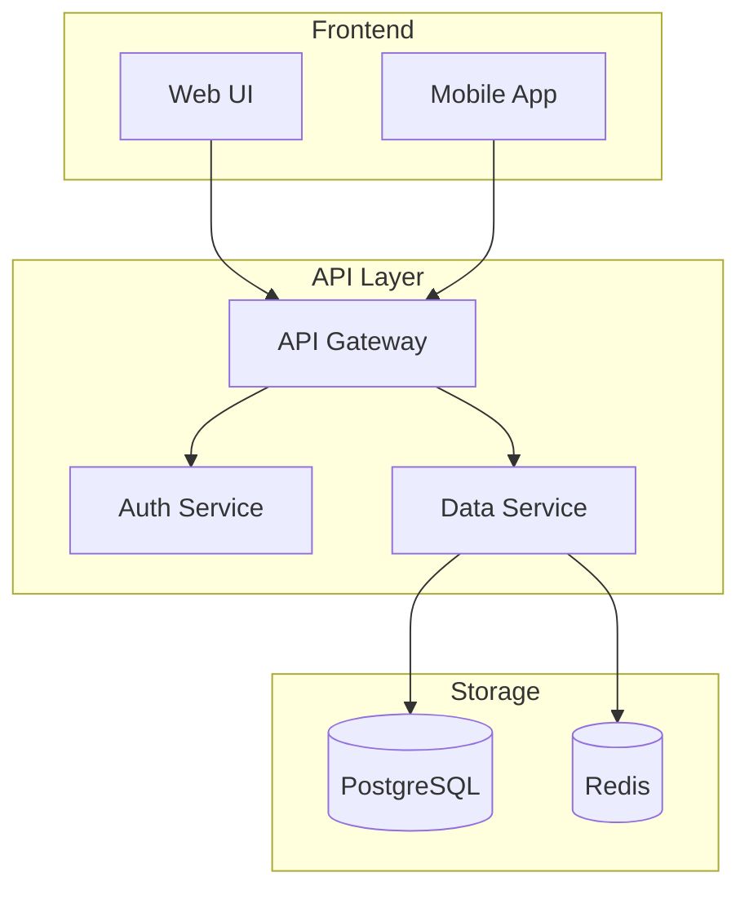
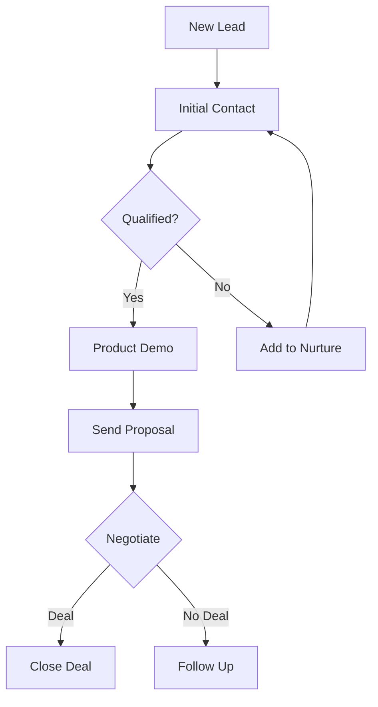

# MetaMD Quick Examples

## Images

```markdown


<!-- Image description:
Login page with email and password fields. Blue "Sign In" button below.
Text reads: "Welcome back" at top, "Forgot password?" link at bottom.
-->
```

## Photos

```markdown


<!-- Image description:
Open office space with 20 desks, large windows on left wall, plants throughout.
Meeting room visible in background with 4 people around table. Natural lighting.
-->
```

## Charts (as data)

```markdown


<!-- Chart data:
Type: Line chart
Title: 2024 Revenue Growth
Data:
| Month | Revenue |
|-------|---------|
| Jan   | $1.0M   |
| Feb   | $1.3M   |
| Mar   | $1.5M   |
| Apr   | $1.8M   |
| May   | $2.0M   |
| Jun   | $2.2M   |
| Jul   | $2.5M   |
| Aug   | $2.7M   |
| Sep   | $3.0M   |
| Oct   | $3.3M   |
| Nov   | $3.7M   |
| Dec   | $4.5M   |
Trend: 350% growth, accelerated in Q4
-->
```

## Pie Charts

```markdown


<!-- Chart data:
Type: Pie chart
Title: Market Share Q4 2024
Data:
| Segment | Percentage |
|---------|------------|
| Enterprise | 45% |
| SMB | 30% |
| Startup | 15% |
| Individual | 10% |
-->
```

## Diagrams (as Mermaid code)

```markdown


<!-- Diagram as Mermaid code:

-->
```

## Flowcharts

```markdown


<!-- Diagram as Mermaid code:

-->
```

## Audio

```markdown
<!-- Audio transcript (meeting.mp3, 2:15):

[00:00] John: Let's discuss Q4 results. Revenue hit $4.5M.

[00:20] Sarah: That's 23% above target. Main driver was enterprise sales.

[00:45] John: Excellent. What about customer satisfaction?

[01:00] Mike: NPS increased to 72, up from 65 last quarter.

[01:30] [Discussion unclear, multiple speakers]

[01:45] John: Let's schedule follow-up on pricing strategy.

[02:00] All: Agreed.
-->
```

## Video

```markdown
<!-- Video content (demo.mp4, 1:00):

[00:00-00:05] Company logo animation

[00:05-00:25] Screen recording: User creating dashboard, adding charts

[00:25-00:40] Presenter explaining features, pointing at screen

[00:40-00:55] Customer testimonial: "Saved us 10 hours per week"

[00:55-01:00] Call-to-action: "Try free at oursite.com"
-->
```

## Screenshots

```markdown


<!-- Screenshot description:
Settings page with tabs: General (selected), Security, Billing.
General tab shows:
- Toggle: "Dark mode" (on)
- Dropdown: "Timezone" (EST selected)  
- Checkbox: "Email notifications" (checked)
- Save button (blue, bottom right)
-->
```

## Document Pages

```markdown
<!-- Page 5 from original PDF -->

# Chapter 2: Implementation

Content from page 5...

<!-- Page 6 from original PDF -->

## 2.1 Getting Started

Content from page 6...
```

## Complex Example

```markdown
---
title: Q4 Report
author: Jane Smith
date: 2024-01-15
source: report.pdf (30 pages)
---

# Q4 Performance Report

<!-- Page 1 from original PDF -->

## Executive Summary

Revenue exceeded projections by 15%.


<!-- Image description:
Dashboard with 4 KPI cards across top:
- Revenue: $4.5M (green, up arrow)
- Customers: 12,500 (blue)
- Churn: 2.1% (yellow, down arrow)
- NPS: 72 (green)

Below: Line graph showing monthly revenue trend, steady upward slope.
Table on right lists top 5 customers by revenue.
-->

## CEO Commentary

<!-- Audio transcript (ceo-message.mp3, 0:30):
[00:00] CEO: This quarter proves our strategy is working. The 15% beat
on revenue while reducing churn shows we're delivering real value.
[00:20] We'll continue investing in product and customer success in Q1.
-->

<!-- Page 2 from original PDF -->

## Detailed Metrics

| Metric | Target | Actual | Variance |
|--------|--------|---------|----------|
| Revenue | $3.9M | $4.5M | +15.4% |
| New Customers | 2,000 | 2,150 | +7.5% |
| Churn Rate | 3.0% | 2.1% | -30% |
```