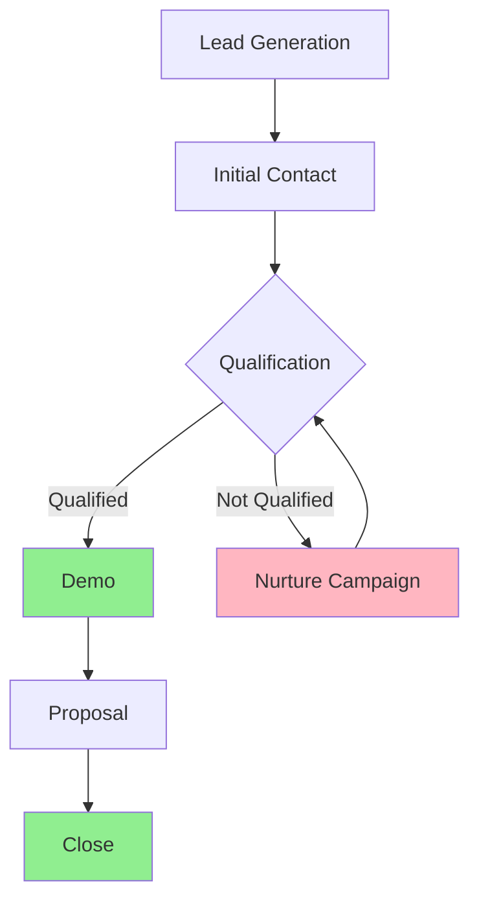
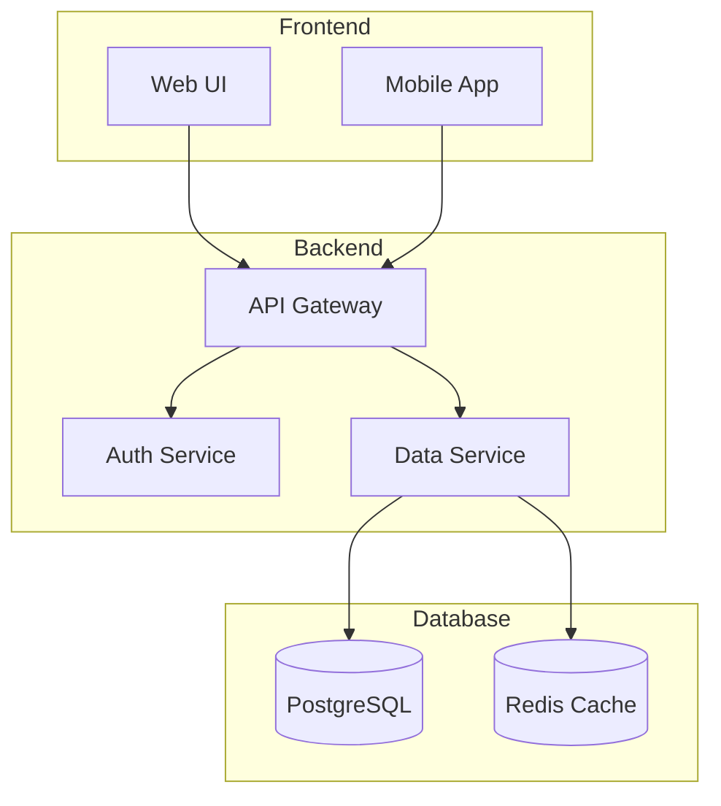
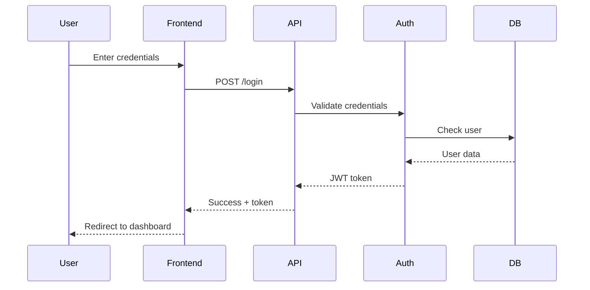
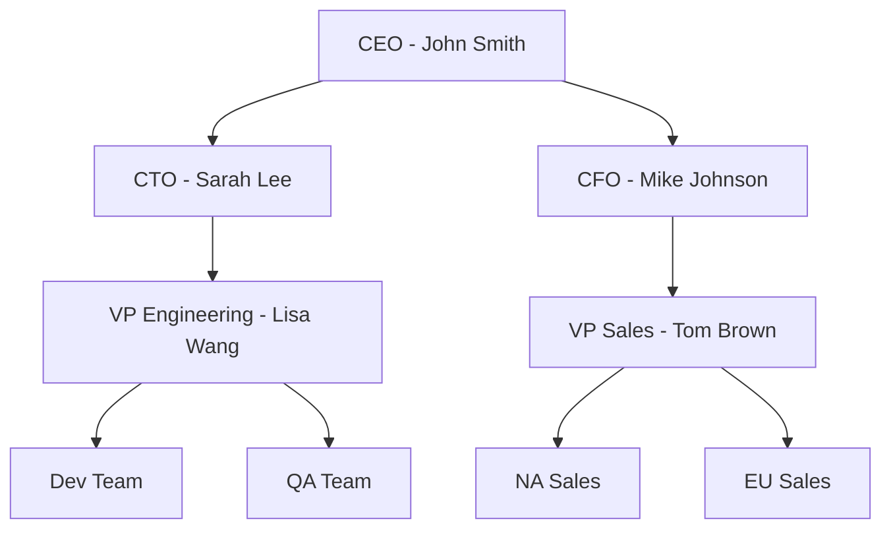

# MetaMD - Enriched Markdown for RAG Systems

## Core Purpose

MetaMD adds descriptions of non-text content (images, audio, video) to make documents fully searchable and understandable by LLMs.

## Format Structure

```markdown
---
title: Document Title
author: Author Name
date: 2024-01-15
source: original.pdf (45 pages)
---

# Regular Markdown Content

Normal text, headers, lists, tables work as usual...

[Media descriptions go where media appears]
```

### Workspace Metadata

Every conversion emits metadata pointing to the persisted workspace on disk:

- `workspace.directory` — absolute path to the per-document workspace folder
- `workspace.sourceFile` — copied source document path (when source persistence is enabled)
- `workspace.markdownFile` — path to the composed Markdown saved alongside artifacts

These entries allow downstream systems to locate the raw inputs, extracted artifacts, and canonical Markdown output without recomputing the conversion.

## Media Enrichment Formats

### 1. Images & Photos

```markdown


<!-- Image description:
A financial dashboard showing Q4 2024 performance. The main area contains 
a line graph trending upward from $3.2M to $4.5M across Oct-Dec. Three KPI 
cards at the top show: Revenue $4.5M (green, +23%), Customers 12,500 (blue, +15%), 
and Conversion 3.8% (yellow, +0.6pp). A data table below lists regional performance.
Visible text: "Q4 2024 Performance Dashboard", "Export PDF", "Last updated: Dec 31"
Table data:
| Region | Q4 Revenue | YoY |
| --- | --- | --- |
| North America | $2.1M | +18% |
| Europe | $1.5M | +12% |
| Asia Pacific | $0.9M | +25% |
-->
```

### Special Case: Tables with Merged Cells

**Important:** When extracting tables from images that contain merged cells (cells that span multiple rows or columns), you MUST duplicate the merged cell's value across all affected rows and columns. This ensures no empty cells appear in the markdown table, which would cause parsing errors.

Example of handling merged cells:

Original table in image has "Laptop" spanning 3 rows:
```
┌────────┬────────────────────┬────────────┬──────────┐
│ ITEM   │ CONDITION          │ QUANTITY   │ LOCATION │
├────────┼────────────────────┼────────────┼──────────┤
│        │ Refurbished        │ 5          │ Aisle 3  │
│ Laptop ├────────────────────┼────────────┼──────────┤
│ (merge)│ Like-New (Open Box)│ 3          │ Aisle 3  │
│        ├────────────────────┼────────────┼──────────┤
│        │ Used (Grade A)     │ 4          │ Aisle 5  │
└────────┴────────────────────┴────────────┴──────────┘
```

Correct markdown representation (duplicate merged values):
```markdown
Table data:
| ITEM | CONDITION | QUANTITY | LOCATION |
| --- | --- | --- | --- |
| Laptop | Refurbished | 5 | Aisle 3 |
| Laptop | Like-New (Open Box) | 3 | Aisle 3 |
| Laptop | Used (Grade A) | 4 | Aisle 5 |
```

**Key Rules for Merged Cells:**
1. **Never leave empty cells** - Empty cells in markdown tables can cause parsing errors
2. **Duplicate the merged value** - Copy the merged cell's content to every row it originally spanned
3. **Maintain all data** - Ensure no information is lost during the conversion
4. **Preserve relationships** - The duplicated values maintain the logical relationship between columns
5. **Explicit placeholders beat blanks** - If the source leaves a merged region visually empty to signal "no data", emit a concrete placeholder like `NONE` or `N/A` rather than leaving markdown cells blank.

Extended example with row and column spans:

Original layout mixes row spans with a final row that merges all columns:
```
┌───────────────┬───────────────────────────┬────────────┬──────────┐
│ ITEM          │ CONDITION                 │ QUANTITY   │ LOCATION │
├───────────────┼───────────────────────────┼────────────┼──────────┤
│               │ Refurbished               │   5        │ Aisle 3  │
│               │                           │            │          │
│    Laptop     ├───────────────┬───────────┬────────────┤          │
│               │ Like-New (Open Box)       │            │          │
│               │                           │            │          │
│               ├───────────────┼───────────┤      4     │          │
│               │ Used (Grade A)            │            │ Aisle 5  │
├───────────────┴───────────────────────────┴────────────┴──────────┤
│ Clearance Bundle (spans all columns)                              │
└───────────────────────────────────────────────────────────────────┘
```

Flattened markdown (duplicate row/column spans and fill intentional blanks explicitly):
```markdown
Table data:
| ITEM | CONDITION | QUANTITY | LOCATION |
| --- | --- | --- | --- |
| Laptop | Refurbished         | 5 | Aisle 3 |
| Laptop | Like-New (Open Box) | 4 | Aisle 3 |
| Laptop | Used (Grade A)      | 4 | Aisle 5 |
| Clearance Bundle (spans all columns) | Clearance Bundle (spans all columns) | Clearance Bundle (spans all columns) | Clearance Bundle (spans all columns) |
```
The Like-New row duplicates its item label while preserving the true quantity and location, and the clearance bundle repeats its merged text across all four columns so downstream parsers see explicit values everywhere merged cells appeared.

For photos:
```markdown


<!-- Image description:
Group photo of 12 people in business attire standing in a modern office lobby.
Front row (left to right): woman in blue blazer, man in gray suit with red tie,
woman in black dress. Back row: 9 people in business casual. Company logo 
"TechCorp" visible on wall behind them. Natural lighting from large windows.
-->
```

### Multi-Page Tables

When a table spans multiple source pages the Markdown includes structural comments so downstream tools can keep track of the original layout while still rendering a single logical table.

```markdown
<!-- Table spans pages 15-16 -->
| TEST NAME | SPECIMEN TYPE | REQUESTED VOLUME | CONTAINER | STORAGE / TRANSPORT | COMMENTS |
| --- | --- | --- | --- | --- | --- |
| Culture AFB | Sputum (expectorated or induced) | 5-10 mL | 50 mL sterile conical tube | Transport refrigerated as soon as possible and within 96 hours. | ... |
| Culture AFB | BAL, brush or wash, other respiratory fluids | 5-10 mL | 50 mL sterile conical tube or sterile urine collection container | Transport refrigerated as soon as possible and within 96 hours. | ... |
<!-- Table 4 continues on page 16 (pages 15-16) -->
```

- The first comment (`<!-- Table spans pages X-Y -->`) is emitted immediately before the Markdown table.
- Each continuation page receives a lightweight comment (`<!-- Table 4 continues on page 16 (pages 15-16) -->`) so the page segment still records the table without duplicating rows.
- `ConversionArtifacts.Tables` records the range in metadata:  
  - `table.pageStart` – first page where the table appears  
  - `table.pageEnd` – last page when the table spans multiple pages  
  - `table.pageRange` – `"start-end"` or the single page when it fits on one page  
  - `tableIndex` – ordinal identifier (`Table 4` in the example)

Every document segment keeps the original page number in `segment.AdditionalMetadata["page"]`, so RAG indexers can align the table comments and metadata with the source PDF or DOCX quickly.

Merged cells in the source document need special handling. Flatten the table so each Markdown row and column contains concrete values even when the original layout spans multiple cells. For example, a table where “Laptop” covers three rows should be re-emitted as:

```
| ITEM   | CONDITION           | QUANTITY | LOCATION |
| ---    | ---                 | ---      | ---      |
| Laptop | Refurbished         | 5        | Aisle 3  |
| Laptop | Like-New (Open Box) | 3        | Aisle 3  |
| Laptop | Used (Grade A)      | 4        | Aisle 5  |
```

If the merged region spans multiple pages, still emit the continuation comments and update `table.pageStart`, `table.pageEnd`, `table.pageRange`, and `table.comment` so downstream systems know the logical row appeared across several segments.

### 2. Diagrams (as Code)

When diagrams are extracted from documents, convert them to Mermaid or other diagram code:

```markdown


<!-- Diagram as Mermaid code:

Note: Average cycle time: 45 days
-->
```

For more complex diagrams:

```markdown


<!-- Diagram as Mermaid code:

-->
```

Image tables are captured inside the same `<!-- Image description: ... -->` block under a `Table data:` heading so the Markdown stays compact and tools can discover the tabular content without scanning additional comments.

For sequence diagrams:

```markdown


<!-- Diagram as Mermaid code:

-->
```

For organizational charts:

```markdown


<!-- Diagram as Mermaid code:

-->
```

### 3. Charts (as Data)

For charts, preserve the underlying data in structured format:

```markdown


<!-- Chart data:
Type: Line chart
Title: Monthly Revenue 2024
X-axis: Month
Y-axis: Revenue (USD)
Data:
| Month | Revenue |
|-------|---------|
| Jan   | $1.0M   |
| Feb   | $1.2M   |
| Mar   | $1.4M   |
| Apr   | $1.7M   |
| May   | $2.0M   |
| Jun   | $2.3M   |
| Jul   | $2.5M   |
| Aug   | $2.8M   |
| Sep   | $3.0M   |
| Oct   | $3.5M   |
| Nov   | $4.0M   |
| Dec   | $4.5M   |
Trend: Steady growth with acceleration in Q4
-->
```

For pie charts:

```markdown


<!-- Chart data:
Type: Pie chart
Title: Market Share Q4 2024
Data:
| Company | Share |
|---------|-------|
| Our Company | 23% |
| Competitor A | 31% |
| Competitor B | 19% |
| Competitor C | 15% |
| Others | 12% |
Note: We gained 5pp from Q3
-->
```

For bar charts with multiple series:

```markdown


<!-- Chart data:
Type: Bar chart (grouped)
Title: Regional Sales Q3 vs Q4
Categories: Regions
Series: Q3 2024, Q4 2024
Data:
| Region | Q3 2024 | Q4 2024 | Growth |
|--------|---------|---------|---------|
| North America | $1.8M | $2.5M | +39% |
| Europe | $0.9M | $1.2M | +33% |
| Asia Pacific | $0.5M | $0.8M | +60% |
| Latin America | $0.3M | $0.4M | +33% |
Colors: Q3=blue, Q4=green
-->
```

### 4. Audio Transcripts

```markdown
<!-- Audio transcript (meeting-2024-01-15.mp3, 5:23):

[00:00] Sarah Chen: Let's review Q4 performance. Revenue exceeded targets by 12%.

[00:15] Mike Johnson: Excellent. The new product line contributed significantly.

[00:45] Sarah Chen: Yes, it represented 30% of total sales. Now regarding Q1 projections...

[01:20] Lisa Wang: We're forecasting 15% growth based on current pipeline.

[02:00] Sarah Chen: Good. Let's discuss the marketing budget allocation.
[Speaker unclear]: Should we increase digital spend?

[02:30] Mike Johnson: I recommend shifting 20% from traditional to digital channels.

[03:15] [Multiple speakers discussing, unclear]

[03:45] Sarah Chen: Let's table that for the follow-up meeting. Moving to hiring plans...

[04:30] HR Team Lead: We have 5 open positions, expecting to fill by end of February.

[05:00] Sarah Chen: Perfect. That concludes our updates. Thanks everyone.

[End of transcript]
-->
```

### 5. Video Content

```markdown
<!-- Video content (product-demo.mp4, 3:45):

[00:00-00:15] Intro screen with company logo and product name "DataViz Pro 2.0"

[00:15-00:45] Presenter (male, casual attire) explains main features while standing 
next to large display showing dashboard

[00:45-01:30] Screen recording of software interface:
- Creating new dashboard by dragging widgets
- Connecting to data source (MySQL database)
- Real-time data updates demonstrated

[01:30-02:15] Split screen: presenter on left, software demo on right
- Shows custom formula builder
- Creates calculated field for profit margin
- Applies conditional formatting (red for <10%, green for >20%)

[02:15-02:45] Customer testimonial (woman in office setting):
"We reduced reporting time by 75% using DataViz Pro"

[02:45-03:30] Feature highlights montage:
- Mobile app shown on phone and tablet
- Collaboration features (comments, sharing)
- Export options (PDF, Excel, PowerPoint)

[03:30-03:45] Call-to-action screen: "Start Free Trial at dataviz.com"
Text overlay: "No credit card required" and "24/7 support included"
-->
```

### 6. Screenshots with UI Elements

```markdown


<!-- Screenshot description:
Settings page of web application with left sidebar navigation and main content area.

Left sidebar (dark gray, 200px wide):
- Dashboard (icon: grid)
- Reports (icon: chart)
- Settings (selected, blue highlight)
- Help (icon: question mark)

Main content area - "Settings" heading, three tabs:
1. General (active tab)
2. Security 
3. Notifications

General tab content:
- Toggle: "Dark mode" (enabled, blue)
- Dropdown: "Language" (selected: "English")
- Text field: "Company name" (value: "Acme Corp")
- Checkbox: "Enable analytics" (checked)
- Button: "Save changes" (blue, bottom right)

Footer text: "Last saved: Jan 15, 2024 at 2:30 PM"
-->
```

### 7. Complex Documents with Mixed Media

```markdown
<!-- Page 12 from original PDF -->

## Quarterly Results

Our performance this quarter exceeded all projections.


<!-- Image description:
Bar chart comparing Q3 vs Q4 revenue by product line:
- Software: Q3 $1.2M, Q4 $1.8M (green bars)
- Services: Q3 $0.8M, Q4 $1.0M (blue bars)  
- Support: Q3 $0.5M, Q4 $0.7M (orange bars)
- Hardware: Q3 $0.7M, Q4 $1.0M (gray bars)
Y-axis shows millions USD, X-axis shows product categories
Title: "Q4 Revenue by Product Line - 40% Total Growth"
-->

The growth was driven primarily by software sales, which increased 50% quarter-over-quarter.

<!-- Page 13 from original PDF -->

### Regional Performance

| Region | Q3 Revenue | Q4 Revenue | Growth |
|--------|------------|------------|---------|
| North America | $1.8M | $2.5M | 39% |
| Europe | $0.9M | $1.2M | 33% |
| Asia Pacific | $0.5M | $0.8M | 60% |

<!-- Audio note (ceo-comment.mp3, 0:45):
[00:00] CEO: These results demonstrate the success of our expansion strategy,
particularly in the Asia Pacific region where we've just opened two new offices.
The 60% growth validates our investment in local teams and partnerships.
-->
```

## Key Principles

1. **Describe what you see** - Be specific about visual elements, layout, colors
2. **Include all text** - Any text visible in images should be captured
3. **Note uncertainty** - Use [unclear] or [inaudible] when needed
4. **Timestamps matter** - For audio/video, include time markers
5. **Structure descriptions** - Organize information logically (top to bottom, left to right)
6. **Keep original pages** - Note page numbers from source documents
7. **Handle merged cells** - Always duplicate merged cell values across all affected rows/columns in tables

## Simple Example

```markdown
---
title: Product Launch Presentation  
author: Marketing Team
date: 2024-01-15
source: PowerPoint (20 slides)
---

# Product Launch Plan

<!-- Page 1 from original PPT -->

## Overview

We're launching DataViz Pro 2.0 next month.


<!-- Image description:
Product shot of software dashboard on laptop screen. The dashboard shows 
colorful charts and graphs. Laptop is on white desk with coffee cup and 
notepad nearby. Text overlay: "DataViz Pro 2.0 - See Your Data Clearly"
-->

## Demo Video

<!-- Video content (demo.mp4, 1:30):
[00:00-00:10] Product logo animation
[00:10-00:40] Screen recording showing user creating a chart
[00:40-01:00] Customer testimonial
[01:00-01:30] Feature list with checkmarks appearing
-->

## Timeline

| Milestone | Date | Status |
|-----------|------|---------|
| Beta Launch | Jan 1 | Complete |
| Marketing Campaign | Jan 15 | In Progress |
| Public Launch | Feb 1 | Planned |
```

## Why This Works

- **Machine-Readable**: Diagrams as Mermaid code can be re-rendered and edited
- **Data Preservation**: Charts keep their raw data, not just visual description
- **LLM-Friendly**: Structured formats that AI can understand and manipulate
- **Search-Optimized**: All visual content becomes searchable text
- **Preserves Context**: Page numbers and timestamps maintain document structure
- **Regeneratable**: Diagrams and charts can be recreated from the code/data
- **Compatible**: Still valid Markdown for any parser
- **No Empty Cells**: Tables with merged cells are properly expanded to avoid parsing errors
