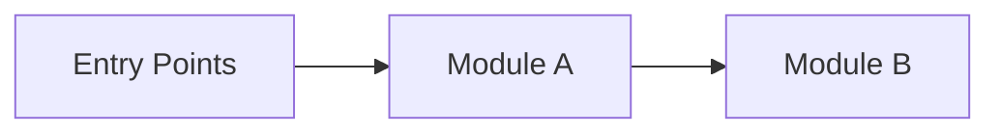
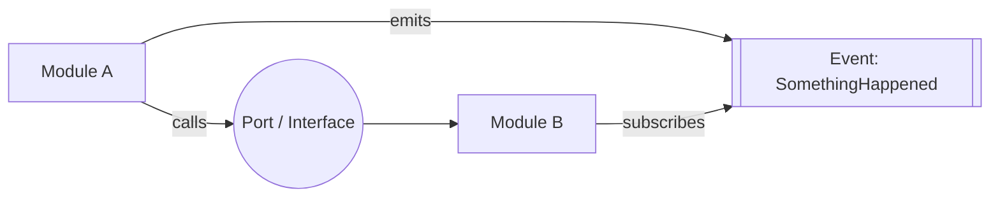
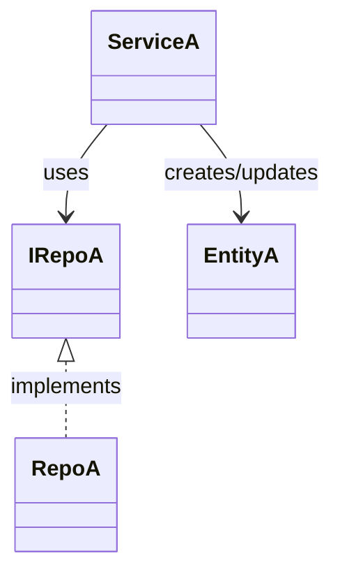

# Architecture Overview

> TEMPLATE ONLY — remove this note and replace all placeholder text before saving as a real `docs/Architecture/Overview.md`.

Goal: in ~5 minutes, understand **what exists**, **where it lives**, and **how modules interact**.

This file is the primary “start here” card for humans and AI agents.

Single source of truth: keep this doc navigational and coarse (diagrams + links). Detailed behaviour belongs in `docs/Features/*`; detailed decisions/invariants belong in `docs/ADR/*`.

## Summary (keep it short)

- **System:**  
- **Where is the code:**  
- **Entry points:**  
- **Dependencies:**  

## Scoping (read first)

- **In scope:** …
- **Out of scope:** …
- Pick impacted module(s) from the diagram + module index (with links).
- Pick entry point(s): API / UI / CLI / job / event.
- Read only: linked ADR/Feature doc(s) → entry-point file(s) → minimum dependencies.
- Stop if scope can’t be mapped to this doc → update this doc (or ask 1 clarifying question).

## 2) Diagrams (Mermaid) — primary context

> TEMPLATE ONLY — this file is the main context tool. Keep these diagrams up to date.  
> Diagrams are for humans and AI agents. They must be self-describing.  
> Model real blocks/modules/interfaces and **key** classes/types (not every file). Add dependencies only if they exist.  
> Every diagram element must be anchored via real, clickable Markdown links in the indexes below (feature docs, ADRs, code paths, entry-point files).  
> From `docs/Architecture/Overview.md`, code links usually start with `../../` (two levels up to repo root).  
> If a diagram becomes a messy “spaghetti graph”, it is incorrect: split by boundary and keep each diagram readable.  
> Remove this note in the real doc.

### 2.1 System / module map (blocks + modules)

> Use real module/service names as node labels. Every node must have a matching entry in “Navigation index” (with real links).

### 2.2 Interfaces / contracts map (how modules talk)

> Show contracts between modules: HTTP endpoints, events, queues, interfaces/ports, file formats. Every contract must have a matching entry in “Navigation index” with a source-of-truth link.

### 2.3 Key classes / types map (main classes and relationships)

> If `classDiagram` is flaky in your renderer, replace it with a `flowchart` that shows the same relationships.
> Use real type names. Every type shown here must appear in “Key classes / types” with a link to where it is defined.

## 3) Navigation index (required, keep it tiny)

> This replaces “tables as inventories”. Keep it high-signal and short.  
> Goal: an agent can jump from any diagram element to the right docs/code without repo-wide scanning.

### 3.1 Modules (diagram nodes)

- `ModuleName` — code: [path/to/module/](../../path/to/module/); entry points: [path/to/entrypoint](../../path/to/entrypoint); docs: [docs/Features/...](../Features/...) / [docs/ADR/...](../ADR/...)

### 3.2 Interfaces / contracts (diagram edges)

- `ContractName` (HTTP/event/queue/interface) — source of truth: [path/to/api-or-contract](../../path/to/api-or-contract); producer/caller: ModuleA; consumer: ModuleB; docs: [docs/ADR/...](../ADR/...)

### 3.3 Key classes / types (optional, high-signal only)

> Include only cross-module/public types that matter for understanding and safe change (usually <= 10–20). Do not list internal implementation classes.

- `TypeName` (class/interface/DTO/event) — defined in: [path/to/TypeName](../../path/to/TypeName); used by: ModuleA / ModuleB

## 4) Dependency rules (must be explicit)

- Allowed dependencies:  
- Forbidden dependencies:  
- Integration style: sync calls / events / shared library  
- Shared code policy:  

## 5) Key decisions (ADRs)

- Link ADRs that define boundaries, dependencies, and cross-cutting patterns.  
- Keep this section link-based. Detailed flows belong in feature docs / ADRs, not in the overview.

- [docs/ADR/ADR-XXXX-some-decision.md](../ADR/ADR-XXXX-some-decision.md) — what it decides, and what it impacts

## 6) Where to go next

- Decisions: [docs/ADR/](../ADR/)  
- Behaviour specs: [docs/Features/](../Features/)  
- How to run + verify: [docs/Development/](../Development/), [docs/Testing/](../Testing/)
